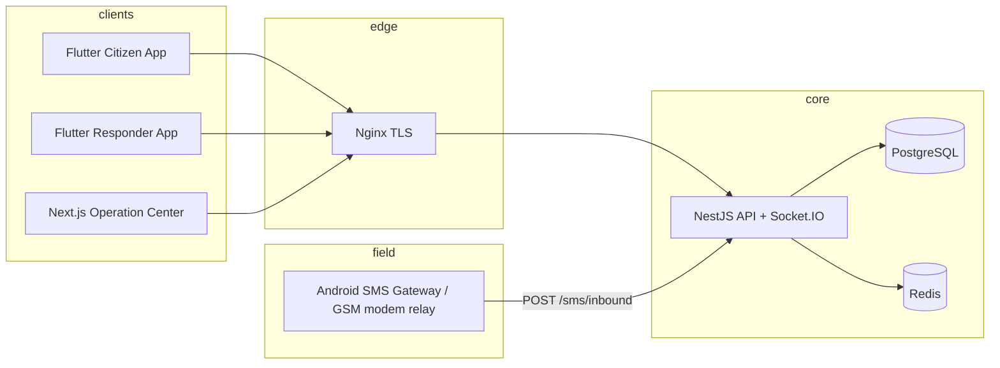
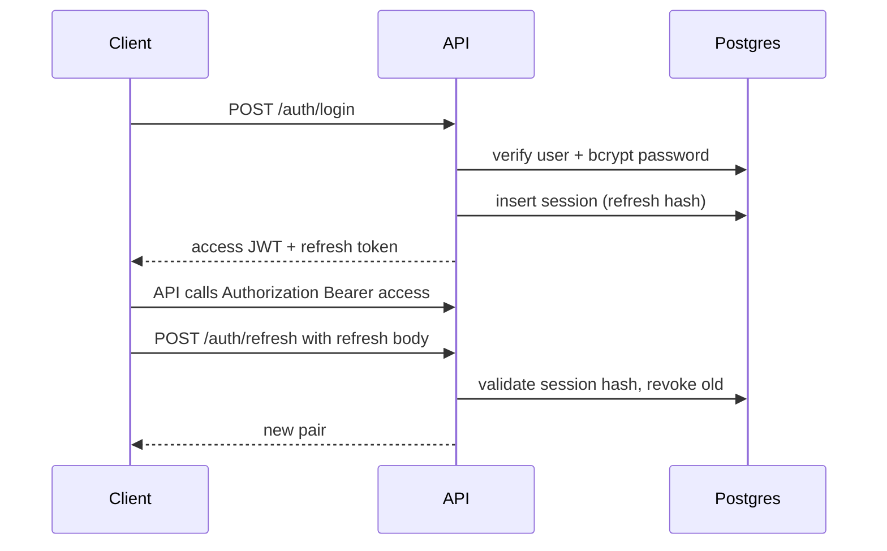
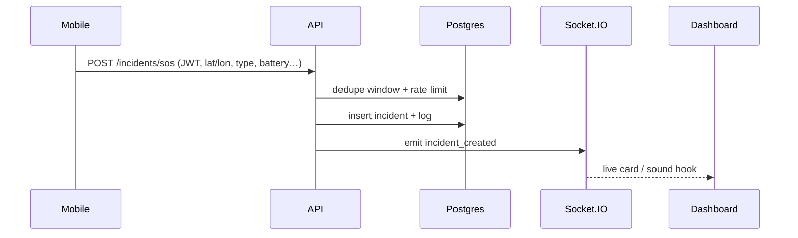
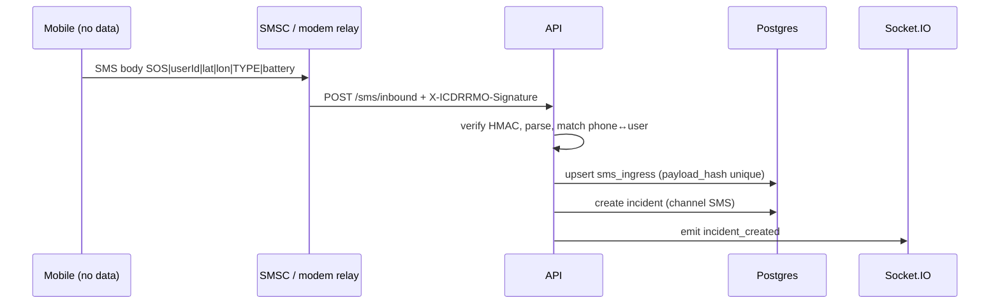

# ICDRRMO SMART Emergency Response — Architecture

For the **full enterprise ecosystem blueprint** (service evolution, DR, scaling, integration matrix), see **`ENTERPRISE_ECOSYSTEM.md`**. For phased delivery status, see **`IMPLEMENTATION_ROADMAP.md`**.

This document summarizes the **system architecture**, **data model**, **realtime design**, **SMS fallback**, **offline strategy**, **deployment topology**, and a **module roadmap** for ongoing rollout.

## 1. High-level system

## 2. Database architecture (PostgreSQL + Prisma)

Single database with **normalized core entities** and **time-series style** location tables (indexed by `recorded_at`).

- **users** — identity, `role` (RBAC), `password_hash`, optional `phone` (unique for SMS matching).
- **user_profiles** — citizen medical + barangay + asset URLs (`profile_photo_url`, `valid_id_url`).
- **emergency_contacts** — ordered contacts per user.
- **responders** — one-to-one extension of `users` who can be assigned; `status` enum; optional **vehicle**.
- **vehicles** — fleet registry.
- **incidents** — `type`, `status`, `channel` (MOBILE_APP | SMS | …), coordinates (`Decimal`), optional `battery_level`, `signal_strength`, `raw_sms_body`.
- **incident_logs** — append-only audit trail per incident (`action`, JSON `details`).
- **barangays** — codes, names, optional GeoJSON polygon + `is_flood_prone`.
- **notifications**, **weather_alerts** — outbound / hazard messaging.
- **user_locations**, **responder_locations** — high-volume GPS; index `(parent_id, recorded_at DESC)`.
- **audit_logs** — security-sensitive actions with `ip_address`, `user_agent`.
- **sessions** — hashed refresh tokens with expiry + revocation.
- **sms_ingress** — dedupe via unique `payload_hash` (`sha256(from|body)`).

Schema file: `backend/prisma/schema.prisma`. Initial SQL migration: `backend/prisma/migrations/00000000000000_init/migration.sql`.

## 3. API architecture

- **Global prefix**: `/api/v1`
- **Validation**: `class-validator` + `ValidationPipe` (whitelist, forbid unknown fields).
- **Auth**: JWT access token (HS256, configurable TTL in seconds) + opaque refresh token stored hashed in **sessions**.
- **RBAC**: `@Roles()` + `RolesGuard` on ops routes (e.g. incident queue).
- **Rate limiting**: `@nestjs/throttler` global guard (tune per-route with `@Throttle`).
- **Realtime**: `@nestjs/platform-socket.io` + `IoAdapter` in `main.ts`.

## 4. WebSocket architecture (Socket.IO)

| Event | Payload (minimal) | Target rooms |
|-------|-------------------|----------------|
| `incident_created` | `{ incidentId, reporterId }` | `ops`, `user:{reporterId}` |
| `incident_updated` | `{ incidentId }` | `ops` |
| `responder_assigned` | (add when dispatch service ships) | `ops`, `responders`, `user:{id}` |
| `responder_location_updated` | `{ responderId, latitude, longitude }` | `ops` |
| `user_location_updated` | `{ userId, latitude, longitude }` | `ops` |
| `weather_alert` | `{ alertId, headline }` | broadcast |
| `emergency_notification` | `{ title, body }` | broadcast |
| `incident_closed` | `{ incidentId }` | `ops` |

**Multi-node note:** for horizontal scaling of Socket.IO, add **Redis adapter** (`socket.io-redis`) so all API replicas share room state.

## 5. Authentication flow

## 6. SOS flow (mobile app → API → ops floor)

**Fake SOS / spam controls (current + planned):** per-user SOS rate limit; duplicate window; planned: device binding, responder verification call, barangay triangulation.

## 7. SMS fallback flow

**Retry queue (planned):** failed relay → BullMQ job on Redis with exponential backoff; dead-letter queue for manual triage.

## 8. Offline synchronization flow (mobile)

1. **Detect connectivity** (`connectivity_plus`).
2. On SOS while offline: **persist outbound DTO** in Hive queue with monotonic `clientRequestId`.
3. Background worker retries **POST /incidents/sos** when online; on repeated transport failure, **compose SMS packet** under length limits (truncate metadata; keep core pipe-delimited fields).
4. Server responds with `deduplicated` flag when same user fires within the server-side dedupe window.

## 9. Weather & hazard integration (roadmap)

| Source | Suggested integration |
|--------|----------------------|
| PAGASA | Scrape or official JSON where permitted; cache + normalize alerts |
| Open-Meteo / OpenWeather | Hourly pull + polygon-weighted alerts for Isabela City bbox |
| RainViewer | Radar tiles URL template for admin map overlay |
| PHIVOLCS | Earthquake ATOM/JSON feed poller → `weather_alerts` rows + push |

`GET /api/v1/weather/alerts` is live as a service endpoint; connect PAGASA / PHIVOLCS / Open-Meteo / RainViewer workers to populate real alerts.

## 10. Deployment architecture

- **docker-compose**: `postgres`, `redis`, `api` (Prisma migrate on start), `admin` (Next standalone), `nginx`.
- **Nginx**: TLS termination in production; WebSocket upgrade headers on `/socket.io/`.
- **Secrets**: inject via env / Docker secrets; never bake into images.

## 11. Rollout roadmap (module order)

1. **Core platform (shipped in repo):** Prisma schema + migration; auth; SOS create; SMS ingest + parser; Socket.IO gateway + Operation Center UI; Docker + Nginx; Redis container ready.
2. **Citizen app:** GPS permission gate, profile wizard, Hive offline queue, Dio interceptors + token refresh, SOS POST + SMS fallback composer.
3. **Responder module:** accept/decline, status machine, vehicle assignment, location uplink throttled by battery/network mode.
4. **Dispatch:** assign responder, ETA, `responder_assigned` events, incident state transitions.
5. **Maps:** Mapbox GL in admin + OSM raster fallback; GeoJSON layers (barangay, flood, evacuation).
6. **Voice:** WebRTC signaling server or Agora tokens — separate small service or Nest gateway module.
7. **Queues:** BullMQ processors — SMS retry, outbound FCM/APNs, weather polling, PHIVOLCS ingest.
8. **Observability:** OpenTelemetry traces, metrics, structured logs.

## 12. Example environment variables

See `backend/.env.example` and root `.env.example`.

## 13. User interface (Operation Center + citizen app)

- **Ops console:** `admin/src/app/ops/page.tsx` (entry: `/ops`; `/dashboard` redirects here) — full-height command layout: branded sign-in, sidebar navigation, stat cards, situation map panel (Mapbox-ready), live incident queue, Socket.IO event stream, and Philippines-localized timestamps.
- **Citizen web:** `admin/src/app/citizen/page.tsx` — register/sign-in against the same auth API under a citizen role, SOS submit; installable via PWA (“Add to Home Screen”).
- **Mobile:** `mobile/lib/features/sos/presentation/sos_home_page.dart` — large circular SOS control; extend with full-screen emergency flow, cancel countdown, and API integration.

---

This system is intended for **regulated, audited** emergency operations. Engage local **NDRRMC / data privacy (DPA)** requirements before production rollout.
