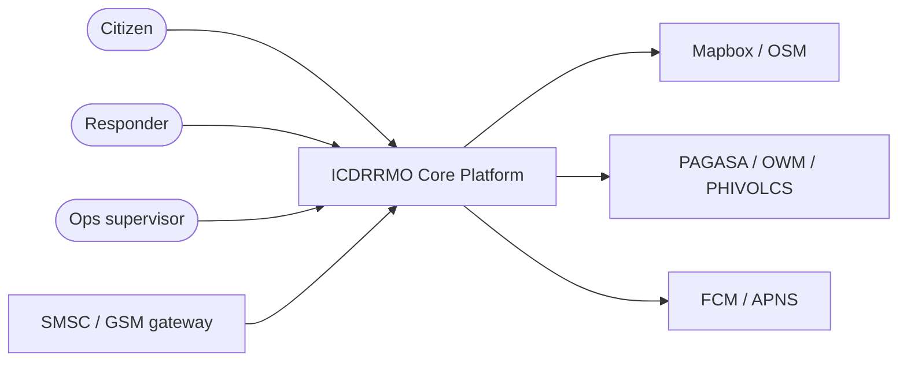
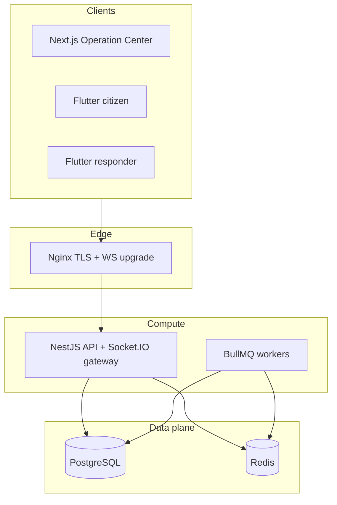
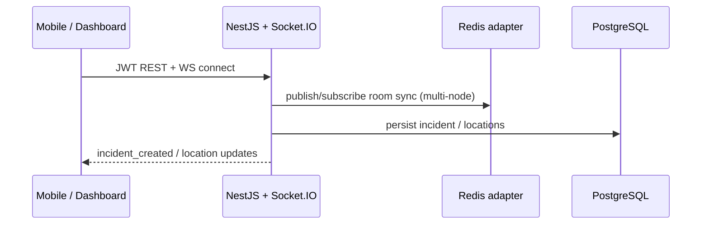
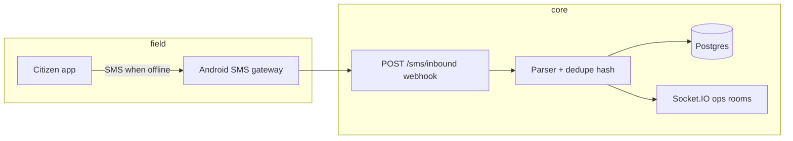

# ICDRRMO Enterprise Smart Disaster Response Ecosystem

This document defines the **target enterprise architecture** for Isabela City’s citywide emergency coordination platform: dispatch-grade workflows, realtime synchronization, offline survivability, telecommunications fallbacks, GIS, weather intelligence, and progressive scaling from **modular monolith → microservices** without losing operational continuity.

Companion documents:

- `ARCHITECTURE.md` — current deployed baseline (API, DB, realtime, SMS).
- `IMPLEMENTATION_ROADMAP.md` — phased delivery against this blueprint.

---

## 1. Architectural principles

| Principle | Design implication |
|-----------|---------------------|
| Mission-critical availability | Stateless API replicas, Redis-backed Socket.IO, Postgres HA, health-checked dependencies |
| Partition tolerance | Queue-backed retries (SMS, notifications); clients tolerate stale reads with reconciliation |
| Offline / degraded networks | Mobile offline queues + SMS SOS grammar + eventual consistency |
| Auditability | Append-only incident logs, RBAC, session + IP capture on sensitive actions |
| Defense in depth | JWT + refresh rotation, rate limits, webhook HMAC, TLS termination at edge |

---

## 2. System context (enterprise view)

---

## 3. Modular monolith → service boundaries (evolution path)

**Phase A (current codebase):** NestJS modular monolith — `Auth`, `Incidents`, `Realtime`, `Sms`, `Weather`, `Jobs` — sharing PostgreSQL + Redis.

**Phase B:** Extract **workers** (BullMQ consumers) into dedicated containers for SMS retry, notification fan-out, GPS batch writes.

**Phase C:** Optional extraction of **voice signaling**, **ingestion webhooks**, or **analytics projection** into isolated services behind an API gateway — same event contracts on Redis pub/sub or NATS/JetStream.

---

## 4. Realtime & synchronization architecture

**Goals:** sub-second incident visibility for ops, resilient reconnects, horizontal scale-out of API nodes.

| Layer | Mechanism |
|-------|-----------|
| Transport | Socket.IO (`/realtime` namespace), JWT in handshake `auth.token` |
| Fan-out (multi-replica) | `@socket.io/redis-adapter` when `REDIS_URL` is set |
| Back-pressure | Server-side throttling + queue-based processors for non-latency-critical work |
| Client recovery | Exponential backoff reconnect; clients replay REST snapshots (`/incidents/queue`, profile) after reconnect |

**Synchronization domains:** incidents, assignment lifecycle (`dispatch_assignments`), responder/citizen GPS samples (`responder_locations`, `user_locations`), weather alerts (`weather_alerts`), notifications (`notifications`), voice session metadata (`voice_call_logs`).

---

## 5. Redis usage matrix

| Capability | Redis structure |
|------------|----------------|
| Socket.IO horizontal scaling | Redis pub/sub via `@socket.io/redis-adapter` |
| BullMQ job queues | Lists / streams via BullMQ (`sms-retry`, `notification-fanout`, `location-batch`) |
| Future rate limiting / dedupe | Dedicated Redis DB or key prefixes |

---

## 6. SMS fallback architecture

Canonical compressed grammar (extendable):  
`SOS|USER_OR_TOKEN|LAT|LON|TYPE|BATTERY|TIMESTAMP`

Controls: HMAC webhook secret, unique `payload_hash`, phone-to-user binding, rate limits, replay rejection.

---

## 7. Voice communication (WebRTC / CPaaS-ready)

**Metadata-first:** `voice_call_logs` stores provider (`WEBRTC`, `AGORA`, `PSTN_BRIDGE`), room/session id, participants, timestamps — suitable for compliance and incident reconstruction; actual media terminates at SFU/TURN or CPaaS outside the monolith.

Future: Nest gateway module issues short-lived tokens; clients negotiate via standard WebRTC or vendor SDK.

---

## 8. GIS & operations overlay model

| Layer | Source |
|-------|--------|
| Basemap | Mapbox GL (primary), OSM raster/vector fallback |
| Administrative | `barangays.geometry_geojson` |
| Facilities | `evacuation_centers` (+ optional polygon) |
| Risk context | `barangays.is_flood_prone`, hazard imports |
| Live geometry | Incident points; responder/citizen tracks from location tables |

---

## 9. Weather & disaster intelligence

Integrations (incremental): **PAGASA**, **OpenWeatherMap**, **RainViewer**, **PHIVOLCS**. Normalize into `weather_alerts` + realtime broadcast (`weather_alert` Socket.IO event). Typhoon/flood/earthquake/evacuation messaging flows through the same notification + ops broadcast channels.

---

## 10. PostgreSQL schema (enterprise extensions)

The Prisma schema adds enterprise-grade entities:

- **`Gender`** on `user_profiles`
- **`evacuation_centers`** — capacity/occupancy, optional GeoJSON footprint
- **`dispatch_assignments`** — multi-unit dispatch lifecycle vs single `assigned_responder_id` on `incidents`
- **`voice_call_logs`** — audit trail for voice sessions
- **`device_tokens`** — FCM/Web push routing
- **`ResponderStatus.UNAVAILABLE`** — explicit unavailability

Migration: `20260509160000_enterprise_ecosystem_extensions`.

---

## 11. REST & realtime surface (design intent)

| Domain | REST (prefix `/api/v1`) | Socket.IO events |
|--------|-------------------------|------------------|
| Auth | `/auth/login`, `/auth/register`, `/auth/refresh` | — |
| Incidents | `/incidents/sos`, `/incidents/queue` | `incident_created`, `incident_updated`, `incident_closed` |
| Locations | planned: POST batch endpoints | `responder_location_updated`, `user_location_updated` |
| Dispatch | planned: assignments CRUD | `dispatch_updated` (future) |
| Weather | `/weather/*` | `weather_alert` |
| SMS | `/sms/inbound` | derived incident events |

---

## 12. Security checklist (production)

- [ ] Rotate JWT secrets (`JWT_ACCESS_SECRET`) — min 32 bytes entropy  
- [ ] TLS everywhere at Nginx; HSTS at edge  
- [ ] Restrict Mapbox / webhook tokens by URL/IP  
- [ ] Enable Postgres SSL + least-privilege DB role  
- [ ] Backup & PITR for Postgres; Redis persistence for queues  
- [ ] SOC-style audit review on `audit_logs`, `sms_ingress`, `voice_call_logs`  
- [ ] Load tests on Socket.IO + REST under concurrent SOS  

---

## 13. Observability & monitoring

| Signal | Tooling |
|--------|---------|
| HTTP metrics | OpenTelemetry + Prometheus exporter (recommended) |
| Logs | JSON structured logs → Loki / Cloud Logging |
| Traces | OTel trace across Nginx → API → DB |
| Socket.IO | Connection counts, reconnect rate, room fan-out lag |
| Queues | BullMQ dashboard / Redis metrics |

---

## 14. Disaster recovery & failover

| Scenario | Pattern |
|----------|---------|
| AZ loss | Multi-AZ Postgres (managed), Redis replica + sentinel/cluster |
| Region DR | Async replication + runbook RTO/RPO; restore object storage for uploads |
| API node crash | Replace behind LB; Socket.IO rooms recovered via Redis adapter |
| SMS storm | Queue + throttle + operator escalation |

---

## 15. Technology alignment (requested stack vs repository)

| Area | Requested | Repository status |
|------|-----------|-------------------|
| Citizen app | Flutter, Riverpod, Hive, Socket.IO, FCM | Flutter app present — expand screens per roadmap |
| Responder app | Dedicated Flutter app | Scaffold / split flavor recommended |
| Admin | Next.js, Tailwind, Mapbox | Operational dashboard — Shadcn/Zustand/React Query optional upgrades |
| Backend | NestJS, Prisma, Redis, BullMQ | **Implemented** + Redis Socket.IO adapter + `JobsService` queues |
| PWA | manifest + SW | `manifest.webmanifest` + `sw.js` + `PwaRegister` |

---

## 16. Implementation truth

This ecosystem is **delivered incrementally**. The codebase provides a **production-shaped foundation** (auth, incidents, realtime, SMS ingest, weather controller, Docker, schema extensions). Remaining modules follow **`IMPLEMENTATION_ROADMAP.md`** — voice mesh, full dispatch UI, worker processors, analytics projections, and external hazard APIs are **explicit next phases**, not implied as finished features.
